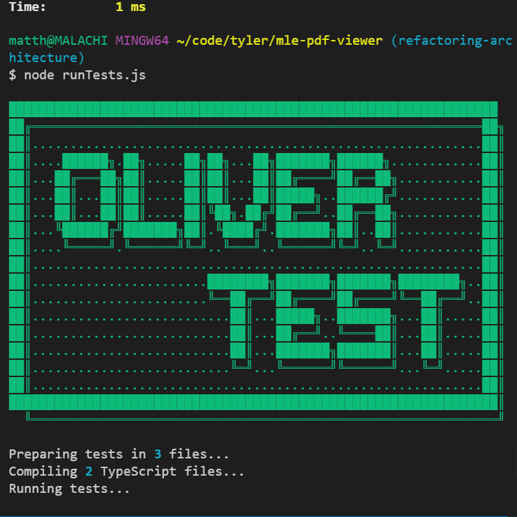
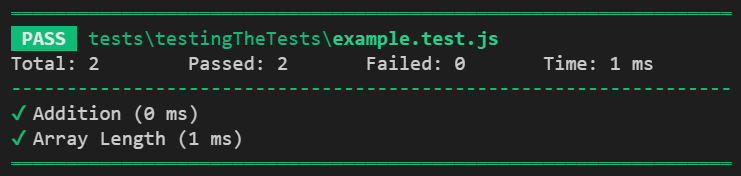
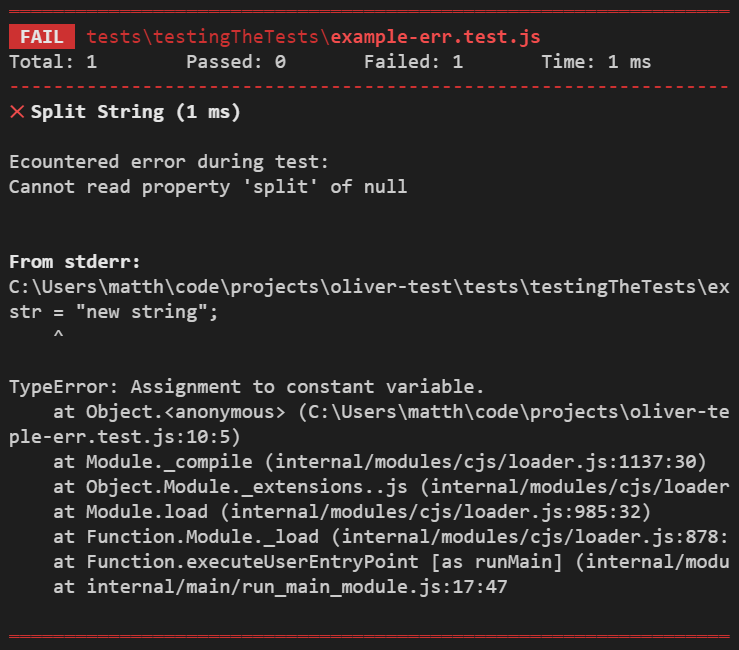

# Oliver Test <!-- omit in toc -->

   

A lightweight and easy-to-use library for testing JavaScript and TypeScript.

<br>



<br><br>

## Contents <!-- omit in toc -->

- [Installation](#installation)
- [Running Tests](#running-tests)
- [Writing Tests](#writing-tests)
  - [Test Suites](#test-suites)
  - [Assertions](#assertions)
  - [Handling Errors](#handling-errors)
- [Mocking](#mocking)
  - [when()](#when)
  - [mock()](#mock)
  - [TypeScript Warning](#typescript-warning)
- [Test Output](#test-output)
  - [Reporting Suites](#reporting-suites)
  - [Reporting Errors](#reporting-errors)
  - [Timing](#timing)


<br><br>

## Installation

Add the node module to your project:

```
$ npm install oliver-test
```
Add a test command:

``` json
// package.json

...
  "scripts": {
    "test": "node <path-to-test-initiator-file>"
  }
...
```


<br><br>

## Running Tests

In order to run tests with Oliver Test, you need to create at least:

- One 'initiator' file that imports and calls `runTestDir(testDir: string)`
and provides a path to your test files.
- One or more test suite files that import and call `test(name: string, testBody:function)`.

See [Writing Tests](#writing-tests) for details on creating these files.

Run your tests by running the 'initiator' file through the console, either directly with `node <path-to-test-initiator-file>` or as an npm script (if you have set one up) with `npm run test`.

For example, consider a project with the following structure:

```
├── package.json
├── run-tests.js
└── tests
    ├── index.test.ts
    ├── injector.test.ts
    └── profiler.test.js
```


``` json
// package.json

...
  "scripts": {
    "test": "node run-tests.js"
  }
...
```

``` js
// run-tests.js

const { runTestDir } = require('oliver-test');
runTestDir('./tests');
```

To run all the the tests in `./tests` you would run `node run-tests.js` or `npm run test`.


<br><br>

## Writing Tests

### Test Suites

Oliver Test expects tests to be organized into test suite files.

The test driver will identify any file as a test suite if it ends in `.test.js` or `.test.ts`. Each test suite may contain any number of tests, which may contain any number of assertions.

Tests are created by calling `test(name: string, testBody:function)` and providing the test body as a callback function.
Assertions are imported as methods of the `expect` object.

Example test suite:

``` js
// example.test.js

const { test, expect } = require('oliver-test');

test("Addition", function() {
    let sum = 2+2;
    expect.equal(sum, 4);
})

test("Array Length", function() {
    let arr = [1,2,3];
    expect.true(arr.length > 0);
})
```

### Assertions

Assertions are all implemented as methods of the `expect` object. These are the supported assertions as of the latest version:

| Assertion | Behavior |
| :-------- | :------- |
| `equal(actual:any, expected:any)` | Checks that `actual` is strongly equal to `expected`. |
| `equalLoose(actual:any, expected:any)` | Checks that `actual` is loosely equal to `expected`. |
| `truthy(actual:any)` | Checks that `actual` is truthy. |
| `true(actual:any)` | Checks that `actual` is equal to `true`. |
| `falsey(actual:any)` | Checks that `actual` is falsey. |
| `false(actual:any)` | Checks that `actual` is equal to `false`. |


### Handling Errors

If an error is not caught within an individual test body the test will fail and print the error.

If an error is not caught during a test suite the suite will fail regardless of how many individual tests had passed.

Any output to `stderr` is considered an error and will fail the test suite.


<br><br>

## Mocking

Oliver Test provides two methods for mocking:

- `when(obj:object, funcName:string, ...args:any)` and
- `mock(className:class)`.

### when()

The `when` function is used to force a specific behavior on any method of an object when it receieves specific arguments to it's parameters. When that method is next called it will examine the arguments it receives and perform the matching mock behavior. If no behavior is defined for the arguments, it will perform its original behavior.

The following methods may be chained indefinitely on to the end of `when` to dictate the mocked behavior:

| Method | Behavior |
| :-------- | :------- |
| `thenDo(action:function)` | The method will execute the provided function. |
| `thenReturn(val:any)` | The method will return the provided value. |
| `thenThrow(err:Error)` | The method will throw the provided error. |

When you chain multiple of these behaviors together, the method will perform one of them in order each time it called. When there is only one remaining, that one will be used indefintely.

Example usage of `when`:

``` js
// example.test.ts

const { when } = require('oliver-test');

const myObj = {
  val: "original value",
  getVal() { return this.val }
}

when(myObj, "getVal", 2)
  .thenDo(()=>console.log("mocked log"))
  .thenReturn("mocked value");

myObj.getVal()    // returns "original value"
myObj.getVal(1)   // returns "original value"
myObj.getVal(2)   // prints "mocked log"
myObj.getVal(2)   // returns "mocked value"
myObj.getVal(2)   // returns "mocked value"
```

### mock()

The `mock` function receives a class as a parameter and returns an object with all of the methods of that class but none of the member variables. It also adds a new method: `when(funcName:string, ...args:any)`. This method wraps the `when` function from Oliver Test, but only mocks methods of the mocked object and provides itself for the object parameter.

This allows you to mock any classes that the object you are testing depends on. Bear in mind that if any of the mocked class's methods depend on member variable they will not work. You should use `when` to mock any method that needs to be called from the mocked class.

Example usage of `mock`:


``` js
// example.test.ts

const { mock } = require('oliver-test');

const testObj = {
  useOtherObject(obj,arg=0){
    obj.getVal(arg)
  }
}

class myClass = {
  constructor() {}
  getVal() { return "original value" }
}

let mockObj = mock(myClass);
mockObj.when("getVal", 2)
  .thenDo(()=>console.log("mocked log"))
  .thenReturn("mocked value");

testObj.useOtherObj(mockObj)    // returns "original value"
testObj.useOtherObj(mockObj,1)   // returns "original value"
testObj.useOtherObj(mockObj,2)   // prints "mocked log"
testObj.useOtherObj(mockObj,2)   // returns "mocked value"
testObj.useOtherObj(mockObj,2)   // returns "mocked value"
```

<br>

### TypeScript Warning

When using `mock` in TypeScript you will need to cast the returned object to `any`. If you don't TypeScript will not accept the mocked object as an instance of the provided class because of the missing fields and additional `when` method. 

<br><br>

## Test Output

A future release will allow the user to specify a `verbose` option to determine the ammount of output.

The test driver runs all tests suites concurrently and prints their results as soon as they complete, regardless of their order.

### Reporting Suites

Each test suite is shown with a summary and list of indidual test names.
The icon to the left of each test indicates its success.



### Reporting Errors

If a test fails an explanation will be printed directly beneath its name.
If there are any suite-level errors they are printed at the end of the summary regardless of when they occurred in the suite file.



### Timing

Test durations are recorded as the composite time during which each individual test ran. This does not include the duration of operations performed by the test driver when starting, compiling, or reporting.
